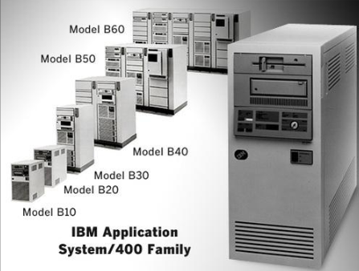
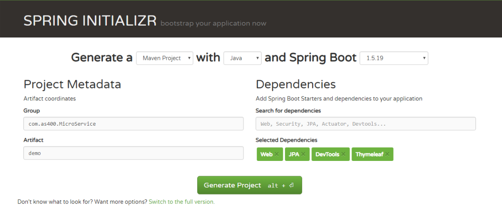
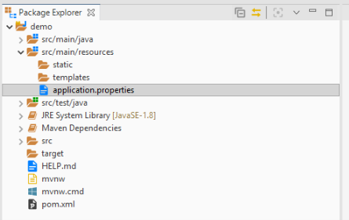
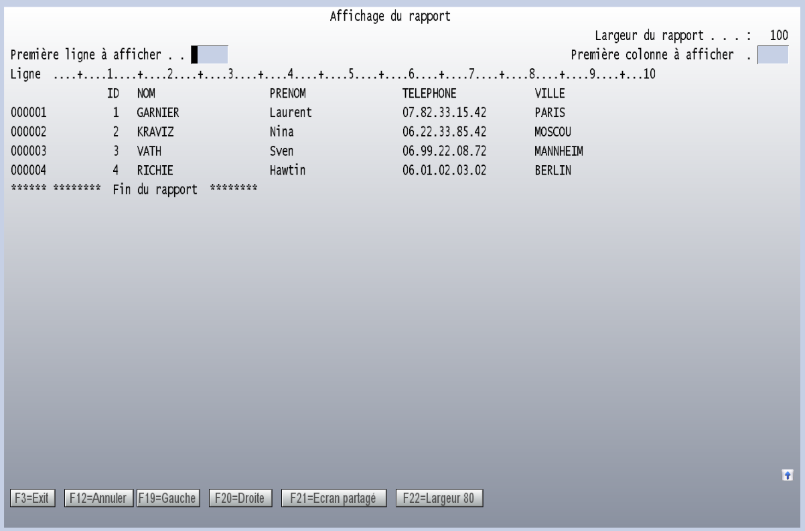
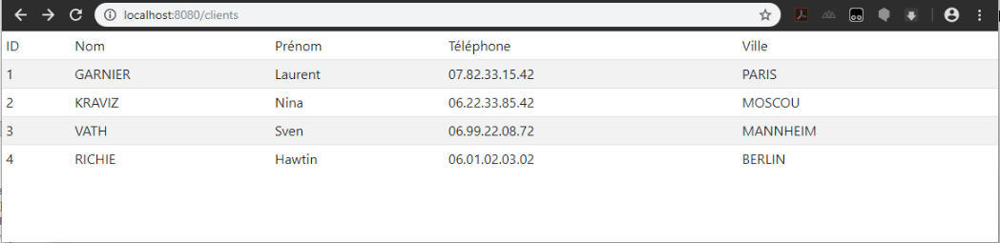
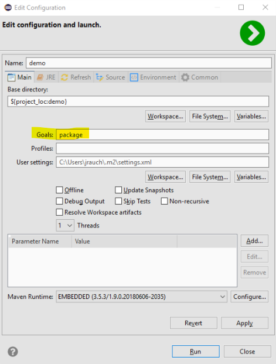

# AS400 et Spring Boot


Présent dans les salles machines depuis plusieurs décennies, l'AS400, "système 36" ou "système 38" ou "système i" ou encore "IBM i" a souvent fait l'objet de moquerie de la part de jeunes développeurs. Un taux de disponibilité de plus de 99,9997%, pas ou très peu de piratage et fiabilité, sa réputation hors-norme rendrait jaloux n'importe quel autre système. Dans les années 90 beaucoup d'éditeurs de logiciels commencent à proposer leur solutions sur cette plateforme : ERP, outils de gestions, comptabilité, ... pour beaucoup de PME l'AS400 reste le cœur du système informatique.

Je vous présente un AS400 :



A l'intérieur on retrouve un OS (comme sur tous les systèmes) et pour nous développeurs :

- Deux langages de programmation : le *RPG* qui est le langage de base et le *CL* qui est à voir comme un Shell permettant de scripter les commandes de base du système ainsi que les application RPG. Il existe une évolution du langage *RPG* appelle *RPG Free* qui est plus proche des langages de programmation que nous connaissons.
- Un moteur de base de données : *DB2*
- Les programmes et les descriptions de base de données sont stockées dans des fichiers, et ces fichiers sont regroupés dans des *bibliothèques*

Les compétences sur AS400 se raréfient, et l'apprentissage du langage RPG (le langage de référence) n'est pas très sexy. On vous propose une mission dans un environnement AS400 ? Ne déprimez pas, il existe des solutions pour moderniser tout cet environnement. 

L'AS400 dispose d'une machine virtuelle Java et il est donc possible de faire tourner des programmes Java sur notre dinosaure. Dans cet article je vais vous expliquer comment créer une application Spring Boot qui sera exécuté et hébergée sur l'AS400.

Dans cet exemple nous allons simplement afficher sur une page web un tableau des clients qui sont stockés dans une table CLIENT dans la bibliothèque JEROME.

## Spring Boot 400

Déjà présenté dans les articles précédents, Spring Boot est un Framework permettant de créer facilement des projet de micro service. 

Pour créer un projet, on va sur https://start.spring.io/ :

- Pour la version de Spring Boot on va prendre la version 1.5.19 car la machine virtuelle de notre AS400 est restée en version 7. Les versions plus récentes de Spring Boot nécessitent la version 8 de la JVM. Il est également possible de créer un projet dans une version plus récente, mais de cas il ne sera pas possible de faire fonctionner l'application sur l'AS400, il faudra l'exécuter sur un autre système et on ne fera qu'utiliser la base de données de l'AS400
- Group : com.as400.MicroService
- Artifact : demo
- Dependencies : Web, JPA, Thymeleaf et DevTools 




On télécharge le squelette du projet et on l'importe en tant que projet Maven avec notre IDE préféré (Eclipse pour moi) :



Afin de se connecter à l'AS400, il suffit d'inclure la dépendance JT400 dans notre pom.xml. Il s'agit d'un driver JDBC permettant à Java de communiquer avec les bases SQL de notre AS400 :

```xml
	<dependencies>
        ...
		<dependency>
		    <groupId>net.sf.jt400</groupId>
		    <artifactId>jt400</artifactId>
		    <version>9.5</version>
		</dependency>
	</dependencies>        
```

Maintenant il faut définir la connexion vers la base de données. Ouvrez le fichier application.properties et ajoutez les lignes suivantes :

```properties
spring.datasource.url=jdbc:as400://as400/JEROME
spring.datasource.username=jerome
spring.datasource.password=YOURPASSWORD
spring.datasource.driver-class-name=com.ibm.as400.access.AS400JDBCDriver
```

- URL : Correspond à la configuration du nom de la machine et de la librairie par défaut :
    jdbc:as400://NOM_DU_SERVEUR/LIBRAIRIE_PAR_DEFAUT
- Username et password : je vous laisse deviner à quoi servent ces champs ;-)
- Et ensuite on préciser le nom du driver à utiliser, qui est fournit par JT400

# Accès aux données

Pour accéder aux données, nous avons (au moins) deux solutions : Utiliser JPA ou alors écrire des requêtes SQL.

Créez une entité Client qui sera mappée à la table CLIENT :

```java
package com.example.demo.entity;

import javax.persistence.Column;
import javax.persistence.Entity;
import javax.persistence.Id;
import javax.persistence.Table;

@Entity
@Table(name="CLIENT", schema="JEROME")
public class Client {
  
	@Id
	@Column(name="ID")
	private long id;
	  
	private String nom;
	private String prenom;
	private String telephone;
  	private String ville;
	  
	public long getId() {
		return id;
	}
    ...
}    
```

On retrouve les annotations JPA classiques :

- @Entity pour préciser que notre objet est une entité JPA
- @Table(name="CLIENT", schema="JEROME") pour définir le nom de la table et sa bibliothèque
- @Id pour définir la clé primaire
- @Column(name="ID") pour définir le nom du champ dans la table de données. Souvent sur les tables AS400 on retrouve des noms qui ne correspondent à rien, on peut donc ainsi les mapper vers des noms propres dans nos objets java

On va créer un repository pour accéder aux données :

```java
package com.example.demo;

import org.springframework.data.repository.CrudRepository;
import com.example.demo.entity.Client;

public interface ClientRepository extends CrudRepository<Client, Long> {

}
```

L'interface CrudRepository nous permet d'accéder aux méthodes "CRUD" pour notre objet Client : save, findOne, findAll, ...
On peut également utiliser l'interface PagingAndSortingRepository qui apporte en plus les fonctions de pagination et de tri. 

Maintenant que nous avons accès aux données, nous allons créer un contrôleur et une page web pour afficher les clients.

```java
package com.example.demo;

import org.springframework.beans.factory.annotation.Autowired;
import org.springframework.stereotype.Controller;
import org.springframework.ui.Model;
import org.springframework.web.bind.annotation.GetMapping;

@Controller
public class ClientController {

	@Autowired
	ClientRepository clientRepository;
  
    @GetMapping("/clients")
    public String greeting(Model model) {
        model.addAttribute("clients", clientRepository.findAll());
        return "clientsList";
    }
}
```
- @Controller pour définir que la classe est un contrôleur Spring Boot qui sera accessible à l'url définie dans @GetMapping.
- @Autowired nous permet d'instancier notre repository qui sera utilisé pour récupérer tous les clients : clientRepository.findAll()
- On passe la liste des clients à la page web dans un attribut nommé "clients", et le template utilisé sera "clientsList".

On va créé le template corresdondant dans resources/templates/clientsList.html !

```html
<body>
	<table class="table table-striped table-hover table-sm">
		<thead>
			<tr>
				<td>ID</td>
				<td>Nom</td>
				<td>Prénom</td>
				<td>Téléphone</td>
				<td>Ville</td>
			</tr>
		</thead>
		<tbody>
			<tr th:each="client : ${clients}">
				<td th:text="${client.id}"></td>
				<td th:text="${client.nom}"></td>
				<td th:text="${client.prenom}"></td>
				<td th:text="${client.telephone}"></td>
				<td th:text="${client.ville}"></td>								
			</tr>
		</tbody>
	</table>
</body>
```

On va simplement créer un tableau et itérer sur les clients.
(Voir le code complet dans mon Github avec les imports css)

On démarre la classe DemoApplication 

Voilà le résultat, l'écran AS400 classique : 



Et sa version web :



Voilà comment moderniser l'affichage d'une application AS400 en mode web, et à partir de là on peut commencer à ré-écrire entièrement une application en ajoutant des formulaires de saisie par exemple, tout en conservant les données sur l'AS400. On peut également utiliser Spring Boot pour développer des micro services qui utilisent les données AS400 et écrire un front en Angular. 

# Utiliser des requêtes SQL au lieu de JPA 

Dans l'exemple ci dessus, comme on ne fait que de l'affichage, il n'est pas nécéssaire d'utiliser JPA. On peut modifier le controler et récupérer directement les données :

```java
  @Autowired
  JdbcTemplate jdbcTemplate;

  jdbcTemplate.queryForList("SELECT * FROM JEROME.CLIENT");
```

Idéalement pour un vrai projet il faudrait utiliser en service entre le contrôleur et le repository ou la requête SQL.

# Déployer l'application sur l'AS400

On va créer un fichier jar depuis notre projet en utilisant Maven (sur le fichier pom.xml on fait Run as / Maven build puis mettre package dans les Goals) :



Maven va nous générer un exécutable : demo-0.0.1-SNAPSHOT.jar

Il suffit de copier ce fichier sur l'AS400 et de lancer la commande :

```sh
RUNJVA CLASS('/HOME/JEROME/demo-0.0.1-SNAPSHOT.jar') 
```

Et voila, l'application est déployée sur votre AS400 et elle est accessible sur http://VOTREAS400:8080/clients

